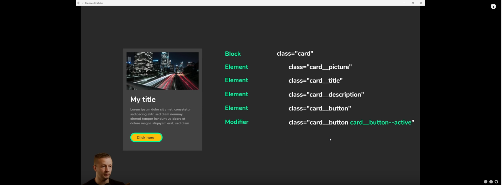
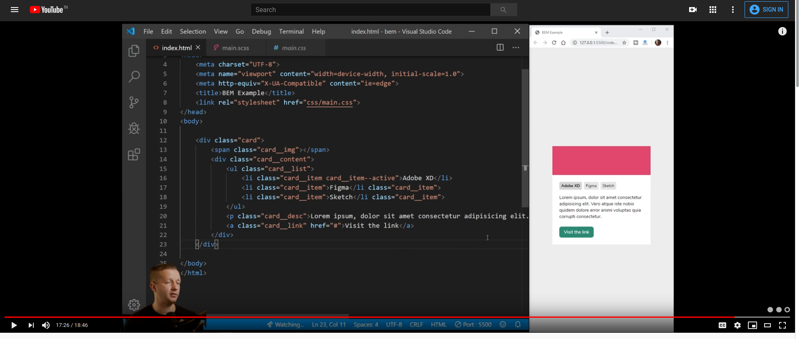

[https://www.youtube.com/watch?v=er1JEDuPbZQ](https://www.youtube.com/watch?v=er1JEDuPbZQ)

- [BEM](#bem)
  - [Block:](#block)
  - [Element](#element)
  - [Modifiers](#modifiers)
  - [Example](#example)
  - [example in html](#example-in-html)
# BEM

Block .  Element .  Modifier

BEM is mostly used with medium and large projects and its nt necessay to uee this in light or small project as it does not make any sense to have it.

## Block:
A standalone entity which makes sense in its own.
represented as **indentifier** example: card, navbar,menu etc

## Element
A part of block that has no standalone meaning and is semantically tied to its block. Its represnted or seperated by **&lt;blockName&gt;__&lt;elementName&gt;** remember the double under score after the block Name eg: card__title, card__image

## Modifiers
A flag on a block or element. Use them to change the appereance or behaviour.

Modifiers are seperated by double dash after the element/block name

**[&lt;blockName&gt; | &lt;blockName&gt;__&lt;elementName&gt;]--&lt;modifierName&gt;;**

, say a button has hover state, and a card has hover state which adds border when u hover over it then: 

card__button--active, card--active

## Example

## example in html

