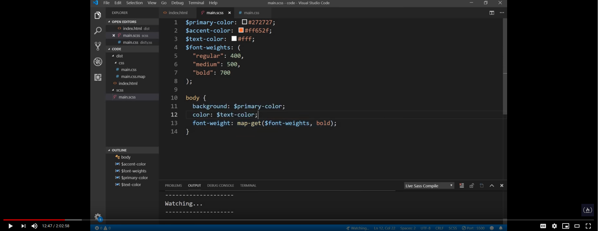
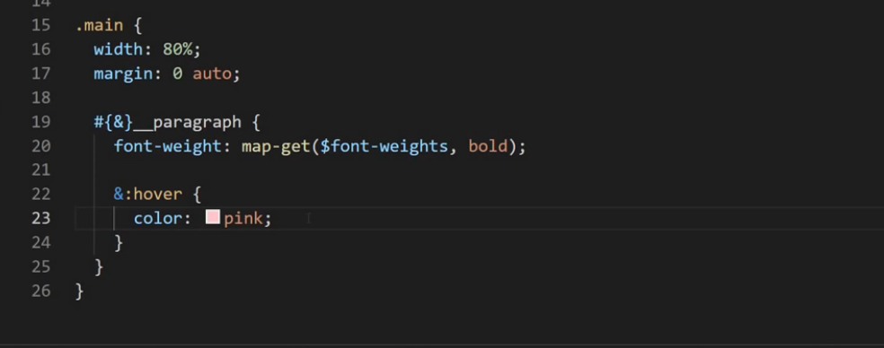

# Scss

- [Scss](#scss)
  - [variables](#variables)
    - [syntax](#syntax)
    - [Scope](#scope)
    - [Shadowing](#shadowing)
    - [Flow Control Scope](#flow-control-scope)
    - [Advanced Variable Functions](#advanced-variable-functions)
    - [interpolation is not allowed for variables](#interpolation-is-not-allowed-for-variables)
  - [Variables values](#variables-values)
    - [number](#number)
      - [Units](#units)

## variables

### syntax
`
$&lt;variableName&gt;: value;`

ex: 
$background: #2727
$border-radius: 5px

Now point to note here is unline css varibale, scss varibales compiles to acual value.

### Scope

Variables declared at the top level of a stylesheet are global. This means that they can be accessed anywhere in their module after they’ve been declared. But that’s not true for all variables. Those declared in blocks (curly braces in SCSS or indented code in Sass) are usually local, and can only be accessed within the block they were declared.

### Shadowing

Local variables can even be declared with the same name as a global variable. If this happens, there are actually two different variables with the same name: one local and one global except flow control scenario. This helps ensure that an author writing a local variable doesn’t accidentally change the value of a global variable they aren’t even aware of.

```
$variable: global value;

.content {
  $variable: local value;
  value: $variable;
}

.sidebar {
  value: $variable;
}

```

css output
```
.content {
  value: local value;
}

.sidebar {
  value: global value;
}

```


### Flow Control Scope

Variables declared in flow control rules have special scoping rules: they don’t shadow variables at the same level as the flow control rule. Instead, they just assign to those variables. This makes it much easier to conditionally assign a value to a variable, or build up a value as part of a loop.

### Advanced Variable Functions

The Sass core library provides a couple advanced functions for working with variables. The meta.variable-exists() function returns whether a variable with the given name exists in the current scope, and the meta.global-variable-exists() function does the same but only for the global scope.

### interpolation is not allowed for variables

## Variables values

### number
Numbers in Sass have two components: the number itself, and its units. For example, in 16px the number is 16 and the unit is px. Numbers can have no units, and they can have complex units. See Units below for more details.

```
@debug 100; // 100
@debug 0.8; // 0.8
@debug 16px; // 16px
@debug 5px * 2px; // 10px*px (read "square pixels")
```

#### Units
```
@debug 4px * 6px; // 24px*px (read "square pixels")
@debug 5px / 2s; // 2.5px/s (read "pixels per second")
@debug 5px * 30deg / 2s / 24em; // 3.125px*deg/s*em
                                // (read "pixel-degrees per second-em")
                                ```

### Strings
Strings are sequences of characters (specifically Unicode code points). Sass supports two kinds of strings whose internal structure is the same but which are rendered differently: quoted strings, like "Helvetica Neue", and unquoted strings (also known as identifiers), like bold. Together, these cover the different kinds of text that appear in CSS.

NOTE:
You can convert a quoted string to an unquoted string using the string.unquote() function, and you can convert an unquoted string to a quoted string using the string.quote() function.
```
@use "sass:string";

@debug string.unquote(".widget:hover"); // .widget:hover
@debug string.quote(bold); // "bold"
```
### Colors

Sass has built-in support for color values. Just like CSS colors, they represent points in the sRGB color space, although many Sass color functions operate in the HSL color space as well. Sass colors can be written as hex codes (#f2ece4 or #b37399aa), CSS color names (midnightblue, transparent), or the functions rgb(), rgba(), hsl(), and hsla().

```
@debug #f2ece4; // #f2ece4
@debug #b37399aa; // rgba(179, 115, 153, 67%)
@debug midnightblue; // #191970
@debug rgb(204, 102, 153); // #c69
@debug rgba(107, 113, 127, 0.8); // rgba(107, 113, 127, 0.8)
@debug hsl(228, 7%, 86%); // #dadbdf
@debug hsla(20, 20%, 85%, 0.7); // rgb(225, 215, 210, 0.7)
```

### Lists
Lists contain a sequence of other values. In Sass, elements in lists can be separated by commas (Helvetica, Arial, sans-serif) or by spaces (10px 15px 0 0), as long as it’s consistent within the list. Unlike most other languages, lists in Sass don’t require special brackets; any expressions separated with spaces or commas count as a list. However, you’re allowed to write lists with square brackets ([line1 line2]), which is useful when using grid-template-columns.

Sass lists can contain one or even zero elements. A single-element list can be written either (<expression>,) or [<expression>], and a zero-element list can be written either () or []. Also, all list functions will treat individual values that aren’t in lists as though they’re lists containing that value, which means you rarely need to explicitly create single-element lists.

###  Maps

Maps in Sass hold pairs of keys and values, and make it easy to look up a value by its corresponding key. They’re written (<expression>: <expression>, <expression>: <expression>). The expression before the : is the key, and the expression after is the value associated with that key. The keys must be unique, but the values may be duplicated. Unlike lists, maps must be written with parentheses around them. A map with no pairs is written ().

```
$font-weights: ("regular": 400, "medium": 500, "bold": 700);

@debug map.get($font-weights, "medium"); // 500
@debug map.get($font-weights, "extra-bold"); // null
```

## operator

### Equality

`==` `!=`

### relational

```
@debug 100 > 50; // true
@debug 10px < 17px; // true
@debug 96px >= 1in; // true
@debug 1000ms <= 1s; // true
```
### Numeric

```
@debug 10s + 15s; // 25s
@debug 1in - 10px; // 0.8958333333in
@debug 5px * 3px; // 15px*px
@debug (12px/4px); // 3
@debug 1in % 9px; // 0.0625in
```
### Boolean Operators 


    not <expression> returns the opposite of the expression’s value: it turns true into false and false into true.
    <expression> and <expression> returns true if both expressions’ values are true, and false if either is false.
    <expression> or <expression> returns true if either expression’s value is true, and false if both are false.


```
@debug not true; // false
@debug not false; // true

@debug true and true; // true
@debug true and false; // false

@debug true or false; // true
@debug false or false; // false
```

## Flow Control


    @if controls whether or not a block is evaluated.

    @each evaluates a block for each element in a list or each pair in a map.

    @for evaluates a block a certain number of times.

    @while evaluates a block until a certain condition is met.

### Truthiness and Falsiness

Anywhere true or false are allowed, you can use other values as well. The values false and null are falsey, which means Sass considers them to indicate falsehood and cause conditions to fail. Every other value is considered truthy, so Sass considers them to work like true and cause conditions to succeed.

For example, if you want to check if a string contains a space, you can just write string.index($string, " "). The string.index() function returns null if the string isn’t found and a number otherwise.

### if else
```
@mixin triangle($size, $color, $direction) {
  height: 0;
  width: 0;

  border-color: transparent;
  border-style: solid;
  border-width: $size / 2;

  @if $direction == up {
    border-bottom-color: $color;
  } @else if $direction == right {
    border-left-color: $color;
  } @else if $direction == down {
    border-top-color: $color;
  } @else if $direction == left {
    border-right-color: $color;
  } @else {
    @error "Unknown direction #{$direction}.";
  }
}

.next {
  @include triangle(5px, black, right);
}

```
### @each
@each <variable> in <expression> { ... }

#### Lists
```
$sizes: 40px, 50px, 80px;

@each $size in $sizes {
  .icon-#{$size} {
    font-size: $size;
    height: $size;
    width: $size;
  }
}
```
#### With Maps
```
$icons: ("eye": "\f112", "start": "\f12e", "stop": "\f12f");

@each $name, $glyph in $icons {
  .icon-#{$name}:before {
    display: inline-block;
    font-family: "Icon Font";
    content: $glyph;
  }
}
```

### @for 
The @for rule, written @for <variable> from <expression> to <expression> { ... } or @for <variable> from <expression> through <expression> { ... }, 

```
$base-color: #036;

@for $i from 1 through 3 {
  ul:nth-child(3n + #{$i}) {
    background-color: lighten($base-color, $i * 5%);
  }
}
```

###  @while

The @while rule, written @while <expression> { ... }, evaluates its block if its expression returns true. Then, if its expression still returns true, it evaluates its block again. This continues until the expression finally returns false.

```
/// Divides `$value` by `$ratio` until it's below `$base`.
@function scale-below($value, $base, $ratio: 1.618) {
  @while $value > $base {
    $value: $value / $ratio;
  }
  @return $value;
}

$normal-font-size: 16px;
sup {
  font-size: scale-below(20px, 16px);
}

```


## Map
A key value pair data structure

### syntax
**$ &lt;mapName&gt;:(
    "keyName":value,
    "anotherKey:another Value
);**

#### Example:
```
$font-weight:(
    regular: 400,
    medium: 500,
    bold: 700
);

```

### get map value
**map-get($font-weight,regular);**

```
Example: body{

    font-weight:map-get($font-weight,bold);


}

```



## Nesting

Make sure you do not nest reusable classes unnecessary.

### &

& is used to refer to parent block name.

Example:

```
.main{

    ....
    ....
    .main__paragraph{

        ...
        ....
    }
}

Can be re-written as

.main{

    ....
    ....
    &__paragraph{

        ...
        ....
    }
}
```

it will be compiled as:

```

.main{

    ....
    ....
   
}

 .main__paragraph{

        ...
        ....
    }

so point to note here is, the above scss code even though its nested syntactically but in css, it actually compiled as to two seperate class on its own.

```

### How do you actually nest i.e target `.main .main__paragraph` like scenario? or in other word **What is scss interpolation ?**

when we write only `&` , it says hey scss compiler substitute it with parent block name but when use interpolation i.e `#{&}` it says to sccss "i dont want u to only replace the parent name but also the whatever is in side parent block".

Well, to actually `div a` kind of css definition, we can use interpolation on `&` element like below:

#### interpolation example


```
.main{

    ....
    ....
   #{&}__paragraph{ //note the has and curly braces around the `&`

        ...
        ....

        //even u can have 
        &:hover{
            color:red;
        }
    }
}
```

it will be compiled as:

```

.main .main__paragraph{

        ...
        ....
    }

 

so point to note here is, the above scss code even though its nested syntactically but in css, it actually compiled as to two seperate class on its own.

```




## scss partials

in large projects there are scenario when u want to split your large scss files into multiple small files but still you wants to have only one css file not multiple.

in that scenario you can scss partials. scss partials file name starts with an underscore(_) example: `_variables.scss`.

Now scss compilers understands it and it wont create `variables.css` file.

to import the partials just do:

`@import variables` // note there is no underscore in import statemebt but its there in file name.


## functions

its similar to functions you know from programming languages.

### SYNTAX

```
@function <FunctionName> ([$param1,$param2]){
    .....
    ....
    @return map-get($font-weight,bold); //return is optional
}
```

#### Example:

```
@function weight($weight-name){
    
    @return map-get($font-weight,$weight-name);
}

body{
    //calling function
    font-weight:weight(bold);
}
```

## Mixins

Its similar to functions but there is major difference and the difference is "on being called, it replaces it self with whatever is inside that mixin".

For example:

Say you want to auto prefix the vendor specif css prefixes, in that writing/repeating the same thing would be cumbersome. to solve this issue what you can do is rather write a mixin.

* Now mixin can accept zero or more parameter.
* if your mixin is not accepting any param, then its perfectly fine to ignore `()` brackets.


Example:

```
//mixin definition, note () is ignored here
@mixin flex-center{
    display:flex;
    justify-content:center;
    align-items:center;
}


//including mixin here

.main{

    @include flex-center; //see its included
    ....
    ....
}
```

### passing arg to mixin

```
//mixin definition, note () is used here
@mixin flex-center($direction){
    display:flex;
    justify-content:center;
    align-items:center;
    flex-direction: $direction;
}


//including mixin here

.main{

    @include flex-center(column); //see its included
    ....
    ....
}
```

## function vs mixin

Function is used to compute and return some value but mixin is used to include css instead.

##  Comments 

```
// This comment won't be included in the CSS.

/* But this comment will, except in compressed mode. */

/* It can also contain interpolation:
 * 1 + 1 = #{1 + 1} */

/*! This comment will be included even in compressed mode. */

p /* Multi-line comments can be written anywhere
   * whitespace is allowed. */ .sans {
  font: Helvetica, // So can single-line commments.
        sans-serif;
}

```

### Documentation Comments permalink Documentation Comments

When writing style libraries using Sass, you can use comments to document the mixins, functions, variables, and placeholder selectors that your library provides, as well as the library itself. These are comments are read by the SassDoc tool, which uses them to generate beautiful documentation. Check out the Susy grid engine’s documentation to see it in action!

Documentation comments are silent comments, written with three slashes (///) directly above the thing you’re documenting. SassDoc parses text in the comments as Markdown, and supports many useful annotations to describe it in detail.

```

/// Computes an exponent.
///
/// @param {number} $base
///   The number to multiply by itself.
/// @param {integer (unitless)} $exponent
///   The number of `$base`s to multiply together.
/// @return {number} `$base` to the power of `$exponent`.
@function pow($base, $exponent) {
  $result: 1;
  @for $_ from 1 through $exponent {
    $result: $result * $base;
  }
  @return $result;
}

```


## @use and Module

The `@use` rule loads mixins, functions, and variables from other `Sass stylesheets`, and combines CSS from multiple stylesheets together. Stylesheets loaded by @use are called "modules". Sass also provides built-in modules full of useful functions.

`The simplest @use rule is written @use "<url>", which loads the module at the given URL. Any styles loaded this way will be included exactly once in the compiled CSS output, no matter how many times those styles are loaded.`

NOTE: A stylesheet’s @use rules must come before any rules other than @forward, including style rules. However, you can declare variables before @use rules to use when configuring modules.

```
// foundation/_code.scss
code {
  padding: .25em;
  line-height: 0;
}
```
```
// foundation/_lists.scss
ul, ol {
  text-align: left;

  & & {
    padding: {
      bottom: 0;
      left: 0;
    }
  }
}
```

```
// style.scss
@use 'foundation/code';
@use 'foundation/lists';

```
CSS output
```
code {
  padding: .25em;
  line-height: 0;
}

ul, ol {
  text-align: left;
}
ul ul, ol ol {
  padding-bottom: 0;
  padding-left: 0;
}
```

### access members from scss modules and namespace
You can access variables, functions, and mixins from another module by writing <namespace>.<variable>, <namespace>.<function>(), or @include <namespace>.<mixin>().

By default, the namespace is just the last component of the module’s URL.

**NOTE:**
Because @use adds namespaces to member names, it’s safe to choose very simple names like $radius or $width when writing a stylesheet. This is different from the old @import rule, which encouraged that users write long names like $mat-corner-radius to avoid conflicts with other libraries, and it helps keep your stylesheets clear and easy to read!

```
// src/_corners.scss
$radius: 3px;

@mixin rounded {
  border-radius: $radius;
}
```

```
// style.scss
@use "src/corners";
//here default namespace is `corners`
//@use "src/corners" as c; 
//in the above case namespace is `C`

.button {
  @include corners.rounded;
  //@include C.rounded;
  padding: 5px + corners.$radius;
}
```
#### module without name space

You can even load a module without a namespace by writing @use "<url>" as *. We recommend you only do this for stylesheets written by you, though; otherwise, they may introduce new members that cause name conflicts!

```
// src/_corners.scss
$radius: 3px;

@mixin rounded {
  border-radius: $radius;
}

// style.scss
@use "src/corners" as *;

.button {
  @include rounded;
  padding: 5px + $radius;
}
```
### Private Members

As a stylesheet author, you may not want all the members you define to be available outside your stylesheet. Sass makes it easy to define a private member by starting its name with either - or _. These members will work just like normal within the stylesheet that defines them, but they won’t be part of a module’s public API. That means stylesheets that load your module can’t see them!
```
// src/_corners.scss
$-radius: 3px;

@mixin rounded {
  border-radius: $-radius;
}

// style.scss
@use "src/corners";

.button {
  @include corners.rounded;

  // This is an error! $-radius isn't visible outside of `_corners.scss`.
  padding: 5px + corners.$-radius;
}

```

### Finding the Module

It wouldn’t be any fun to write out absolute URLs for every stylesheet you load, so Sass’s algorithm for finding a module makes it a little easier. For starters, you don’t have to explicitly write out the extension of the file you want to load; @use "variables" will automatically load variables.scss, variables.sass, or variables.css.

#### Load Paths

All Sass implementations allow users to provide load paths: paths on the filesystem that Sass will look in when locating modules. For example, if you pass node_modules/susy/sass as a load path, you can use @use "susy" to load node_modules/susy/sass/susy.scss.

Modules will always be loaded relative to the current file first, though. Load paths will only be used if no relative file exists that matches the module’s URL. This ensures that you can’t accidentally mess up your relative imports when you add a new library.

#### Index Files

If you write an _index.scss or _index.sass in a folder, the index file will be loaded automatically when you load the URL for the folder itself.

## @forward
The rule is written @forward "<url>". It loads the module at the given URL just like @use, but it makes the public members of the loaded module available to users of your module as though they were defined directly in your module. 

## @import
Sass extends CSS's @import rule with the ability to import Sass and CSS stylesheets, providing access to mixins, functions, and variables and combining multiple stylesheets' CSS together. Unlike plain CSS imports, which require the browser to make multiple HTTP requests as it renders your page, Sass imports are handled entirely during compilation.

**Deprecated**

`The Sass team discourages the continued use of the @import rule. Sass will gradually phase it out over the next few years, and eventually remove it from the language entirely. Prefer the @use rule instead.`

## @error 

When writing mixins and functions that take arguments, you usually want to ensure that those arguments have the types and formats your API expects. If they aren't, the user needs to be notified and your mixin/function needs to stop running.

```
@mixin reflexive-position($property, $value) {
  @if $property != left and $property != right {
    @error "Property #{$property} must be either left or right.";
  }

  $left-value: if($property == right, initial, $value);
  $right-value: if($property == right, $value, initial);

  left: $left-value;
  right: $right-value;
  [dir=rtl] & {
    left: $right-value;
    right: $left-value;
  }
}

.sidebar {
  @include reflexive-position(top, 12px);
  //       ^^^^^^^^^^^^^^^^^^^^^^^^^^^^^
  // Error: Property top must be either left or right.
}
```
Error output

```
Error: "Property top must be either left or right."
  ╷
3 │     @error "Property #{$property} must be either left or right.";
  │     ^^^^^^^^^^^^^^^^^^^^^^^^^^^^^^^^^^^^^^^^^^^^^^^^^^^^^^^^^^^^
  ╵
  example.scss 3:5   reflexive-position()
  example.scss 19:3  root stylesheet
  ```

  ## @warn 

  When writing mixins and functions, you may want to discourage users from passing certain arguments or certain values. They may be passing legacy arguments that are now deprecated, or they may be calling your API in a way that’s not quite optimal.

  ```
  $known-prefixes: webkit, moz, ms, o;

@mixin prefix($property, $value, $prefixes) {
  @each $prefix in $prefixes {
    @if not index($known-prefixes, $prefix) {
      @warn "Unknown prefix #{$prefix}.";
    }

    -#{$prefix}-#{$property}: $value;
  }
  #{$property}: $value;
}

.tilt {
  // Oops, we typo'd "webkit" as "wekbit"!
  @include prefix(transform, rotate(15deg), wekbit ms);
}

```

## @debug

Sometimes it’s useful to see the value of a variable or expression while you’re developing your stylesheet. That’s what the @debug rule is for: it’s written @debug <expression>, and it prints the value of that expression, along with the filename and line number.

```
@mixin inset-divider-offset($offset, $padding) {
  $divider-offset: (2 * $padding) + $offset;
  @debug "divider offset: #{$divider-offset}";

  margin-left: $divider-offset;
  width: calc(100% - #{$divider-offset});
}
```
